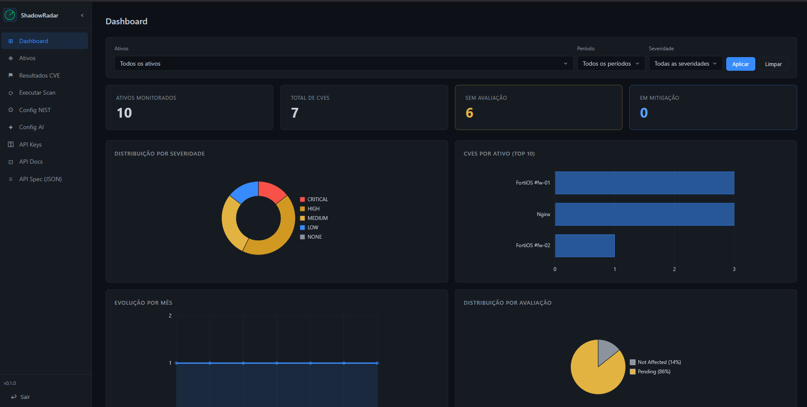
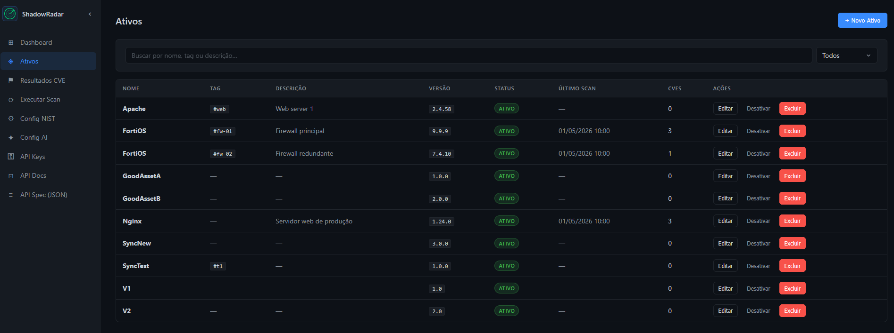
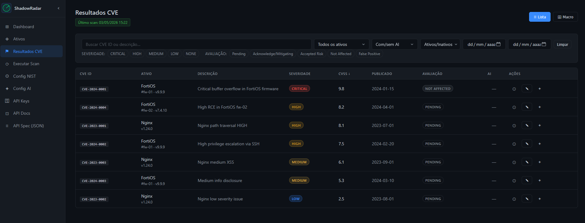

# ShadowRadar

**External Security Posture Management (ESPM)** — CVE monitoring for external assets.

ShadowRadar tracks your external infrastructure (web apps, firewalls, SaaS services, third-party APIs) against the [NIST NVD](https://nvd.nist.gov/) CVE database and optionally enriches each finding with an AI-powered risk assessment via the Claude API. Results are stored locally in SQLite and surfaced through a clean web dashboard.

---

## Screenshots

**Dashboard** — KPI summary, severity distribution, CVEs per asset, monthly trend, and assessment breakdown.



**Assets** — Full asset inventory with version tracking, scan status, and CVE count per asset.



**CVE Results** — Filterable CVE list with severity badges, CVSS scores, AI assessment column, and per-CVE detail panel.



---

## Requirements

| Dependency | Version |
|---|---|
| Node.js | 20+ |

No database server is needed — ShadowRadar uses an embedded SQLite file.

Optional: a [NIST NVD API key](https://nvd.nist.gov/developers/request-an-api-key) (increases rate limits from 5 to 50 requests/30 s) and an [Anthropic API key](https://console.anthropic.com/) for AI-assisted CVE assessments.

> **Scan script:** CVE scanning requires an external script. See [CVE Scan Script](#cve-scan-script) below.

---

## Quick Start

```bash
# 1. Clone and install Node dependencies
git clone https://github.com/Gadotti/ShadowRadar
cd shadowradar
npm install

# 2. Configure environment
cp .env.example .env
# Edit .env — set a strong JWT_SECRET (≥32 random chars)

# 3. Create the database and seed development users
npm run db:migrate
npm run db:seed        # creates admin/admin123 and viewer/viewer123

# 4. Start the server
npm start            # production
```

Open [http://localhost:3500](http://localhost:3500) in your browser.

### Environment variables

| Variable | Default | Description |
|---|---|---|
| `PORT` | `3500` | HTTP port |
| `NODE_ENV` | `development` | `development` or `production` |
| `DB_PATH` | `./data/shadowradar.db` | Path to the SQLite database file |
| `JWT_SECRET` | — | **Required.** Random string ≥ 32 characters |
| `LOG_LEVEL` | `info` | `debug`, `info`, `warn`, `error` |

### CVE Scan Script

CVE scanning is handled by an **external script** — not bundled in this repository. The project [check-cve-assets](https://github.com/Gadotti/check-cve-assets) is being adapted to integrate with ShadowRadar as its scan engine.

Once integrated, scans will be triggerable directly from the **Run Scan** page in the UI, which will spawn the external script as a child process pointed at the ShadowRadar SQLite database.

---

## Authentication

ShadowRadar uses two independent authentication mechanisms:

### Session (browser SPA)

Login at `/#/login` with a username and password. A signed **JWT is stored in an `httpOnly`, `SameSite=Strict` cookie** (30-day expiry). The login endpoint is rate-limited to **10 attempts per 15 minutes per IP**.

### API Keys (external integrations)

Editors can generate API keys from the **API Keys** page. Keys are stored hashed in the database and passed via the `X-API-Key` request header. They grant access to the machine-to-machine endpoints:

| Endpoint | Method | Description |
|---|---|---|
| `/api/v1/export` | GET | Full security report (assets + CVEs + risk level) |
| `/api/v1/assets/sync` | POST | Upsert assets from an external system |

### Roles

| Role | Permissions |
|---|---|
| `reader` | Read-only access to all pages and data |
| `editor` | Full CRUD, scan execution, config changes, API key management |

The seed command creates one account of each role (`admin` / `viewer`). New users can be created interactively:

```bash
npm run create-user
```

---

## Features

- **Asset inventory** — Register external assets with name, tag, URL, version, and a CVE scan start date. Assets can be activated or deactivated individually.
- **CVE scanning** — An external scan script (see [check-cve-assets](https://github.com/Gadotti/check-cve-assets)) queries the NIST NVD API for CVEs matching each asset's software name and version. Results are stored with severity, CVSS score, and publication date.
- **AI assessment** — When an Anthropic API key is configured and AI is enabled, the scan script sends each new CVE to Claude for an automated risk assessment. CVEs that already have an AI assessment are never reprocessed (cost optimisation).
- **Dashboard** — At-a-glance KPIs (monitored assets, total CVEs, unassessed findings, items in mitigation) and four charts: severity distribution, CVEs per asset (top 10), monthly trend, and assessment distribution. All charts support filtering by asset, time period, and severity.
- **CVE results view** — Sortable and filterable table with full-text search, severity chips, AI badge, per-row assessment editor, and an expandable detail panel. Toggle between list and macro (card) view.
- **NIST config** — Set your NVD API key and page size from the UI.
- **AI config** — Enable/disable AI enrichment, set the Anthropic API key, and choose the Claude model.
- **API documentation** — Interactive Swagger UI at `/api/docs` (public, no login required). OpenAPI 3.0 spec available as JSON at `/api/docs/spec`.
- **External sync** — Push asset lists from CI/CD pipelines or asset management tools via `POST /api/v1/assets/sync` (API key required). The `cve_start_date` field is never overwritten once set.
- **Security export** — Pull a full JSON security report with computed risk levels via `GET /api/v1/export`.

---

## Testing

ShadowRadar uses **Jest** with an in-memory SQLite database for isolated, repeatable tests.

```bash
# Run all tests
npm test

# Run a single test file
node --experimental-vm-modules node_modules/jest/bin/jest.js tests/unit/services/authService.test.js
```

### Test helpers

Located in `tests/helpers/`:

| Helper | Purpose |
|---|---|
| `makeDb()` | Spins up an in-memory SQLite DB with all migrations applied |
| `seedUsers()` | Inserts an admin and a viewer account |
| `seedAsset()` | Inserts a test asset |
| `seedCve()` | Inserts a test CVE result |
| `seedConfig()` | Inserts NIST / AI configuration entries |
| `buildTestApp(db)` | Mounts the full Express app against the in-memory DB for HTTP integration tests |

### Test layout

```
tests/
  helpers/      # Shared DB and app factory helpers
  unit/         # Per-module tests (services, repositories, middleware)
  integration/  # Full HTTP round-trip tests via supertest
```

Unit tests instantiate services and repositories directly. Integration tests make real HTTP requests through the Express app, exercising the full middleware stack including authentication and validation.

---

## Architecture

```
Frontend (Vanilla JS / ES Modules, hash-based routing)
    └── HTTP/REST + fetch
Backend (Node.js + Express)
    ├── SQLite via better-sqlite3 (WAL mode)
    └── child_process.spawn → check-cve-assets (external, coming soon)
                                ├── NIST NVD API
                                └── Claude API (optional)
```

No build step — the frontend is plain HTML/CSS/ES modules served statically by Express. Chart.js is bundled locally under `public/vendor/`.

### Key directories

```
src/
  api/           # Express route handlers (thin controllers)
  services/      # Business logic
  repositories/  # SQLite queries
  integrations/  # NIST and Claude API clients
  middleware/    # Auth, validation, error handler
  db/            # Migration runner and connection singleton
public/
  js/
    app.js       # Hash-router entry point
    api.js       # Centralised fetch wrapper
    pages/       # One module per page
    components/  # Reusable UI pieces (sidebar, custom-select)
  css/           # Tokenised stylesheet split by concern
scripts/
  # CVE scan script — provided by check-cve-assets (external repo, integration pending)
```

---

## License

This project is unlicensed. Use at your own discretion.
